# 📚 University Library Management System

<p align="center">
  <strong>A modern full-stack University Library Management System built with Next.js, TypeScript, PostgreSQL, and Appwrite.</strong>
</p>

<p align="center">
  <a href="https://university-library-management-8arl809dt-idusha-garavis-projects.vercel.app/sign-in">
    
  </a>
  &nbsp;
  <a href="https://github.com/IdushaGaravi/University-Library-Management">
    
  </a>
</p>

---

## 🔗 Live Demo

> **Production Deployment:**  
> https://university-library-management-8arl809dt-idusha-garavis-projects.vercel.app/sign-in

---

## 📌 Overview

The University Library Management System is a modern web application designed to streamline university library operations. It provides a seamless experience for both students and administrators by enabling:

- Book browsing and management
- User authentication and authorization
- Borrow request management
- Account approval workflows
- Email notifications
- Admin dashboard for managing books and users
- Secure database integration
- Responsive and modern UI

This project was developed using modern full-stack technologies and follows scalable development practices suitable for production-level applications.

---

## 🚀 Features

### Student Features

- User Registration & Login
- Email Verification
- Browse Available Books
- View Book Details
- Borrow Books
- Manage User Profile
- View Borrow Requests
- Responsive User Dashboard

### Admin Features

- Admin Dashboard
- Manage Library Books
- Add New Books
- Edit Existing Books
- Delete Books
- Manage Users
- Delete Users
- Approve User Accounts
- Manage Borrow Requests
- Library Statistics Overview
- Secure Administrative Controls

### System Features

- Modern Authentication System
- Database Management
- Email Notifications
- Rate Limiting
- Form Validation
- Secure API Handling
- Production Ready Deployment
- Fully Responsive UI

---

## 🛠 Tech Stack

### Frontend

| Technology | Version |
|------------|---------|
| Next.js | 15.x |
| React | 19.x |
| TypeScript | 5.x |
| Tailwind CSS | 4.x |
| ShadCN UI | Latest |
| React Hook Form | Latest |

---

### Backend

| Technology | Version |
|------------|---------|
| Next.js Server Actions | 15.x |
| Node.js | 22.x Recommended |
| TypeScript | 5.x |

---

### Database & Storage

| Technology |
|------------|
| PostgreSQL |
| Drizzle ORM |
| Redis |
| Upstash Redis |

---

### Authentication & Services

| Service |
|--------|
| Appwrite |
| Email Verification |
| Resend |
| Upstash Rate Limiting |

---

### Deployment

| Platform |
|---------|
| Vercel |

---

## 📂 Project Structure

```bash
University-Library-Management
│
├── app/
├── components/
├── constants/
├── database/
├── lib/
│   ├── actions/
│   └── admin/
├── public/
├── screenshots/
├── styles/
└── ...
```

---

## 📷 Application Screenshots

### Homepage


---

### Sign In Page

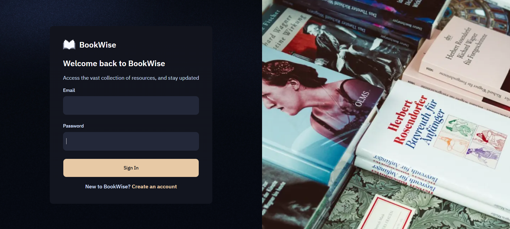

---

### Sign Up Page

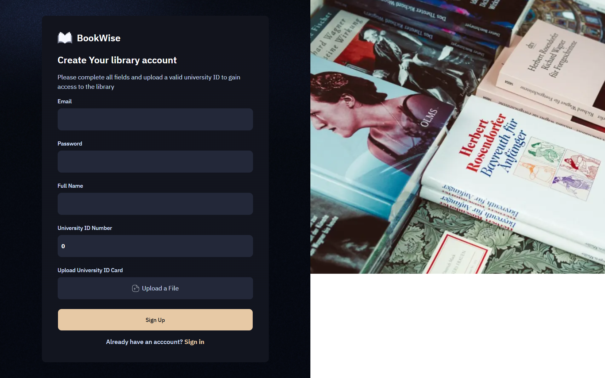

---

### Email Verification / Notification

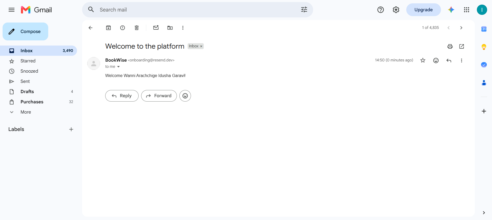

---

### User Profile

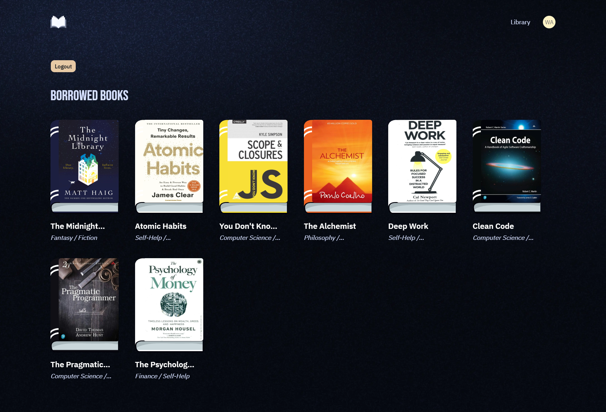

---

### Admin Dashboard

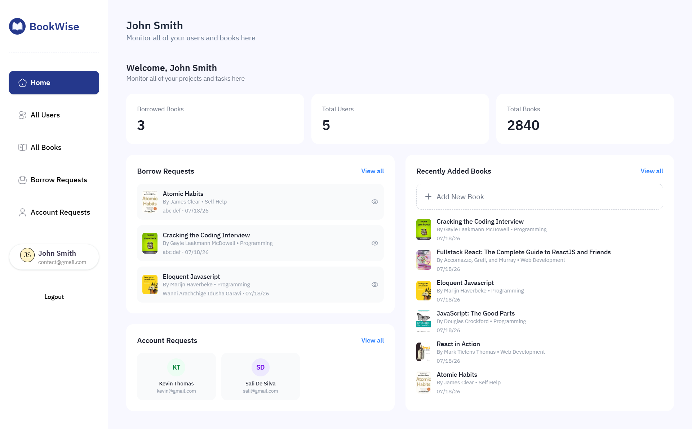

---

### All Users

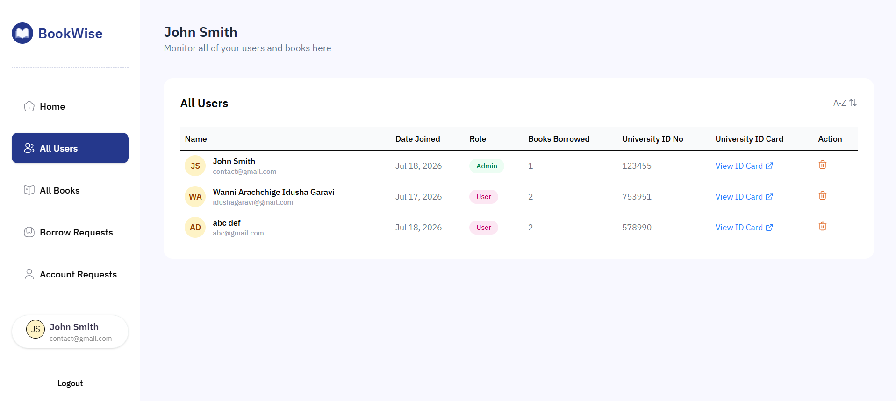

---

### All Books

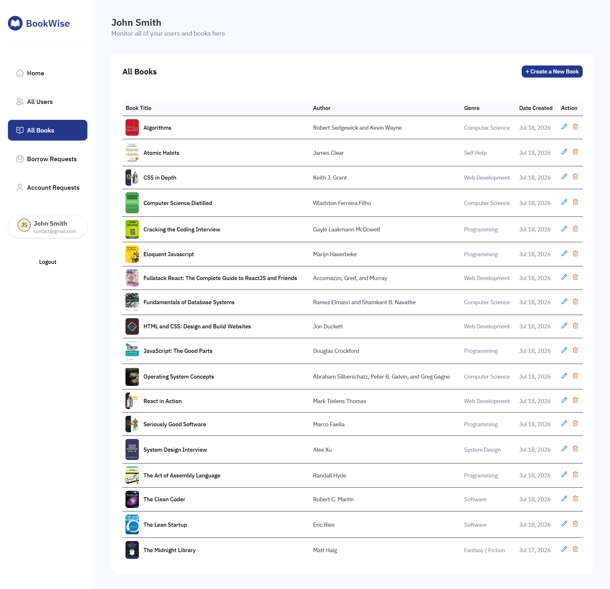

---

### Add New Book

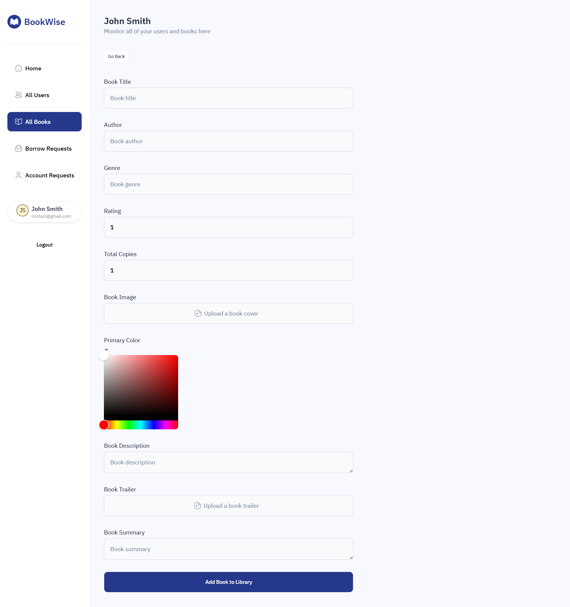

---

### Edit Book

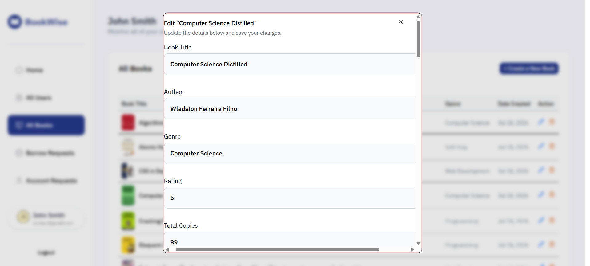

---

### Delete Book

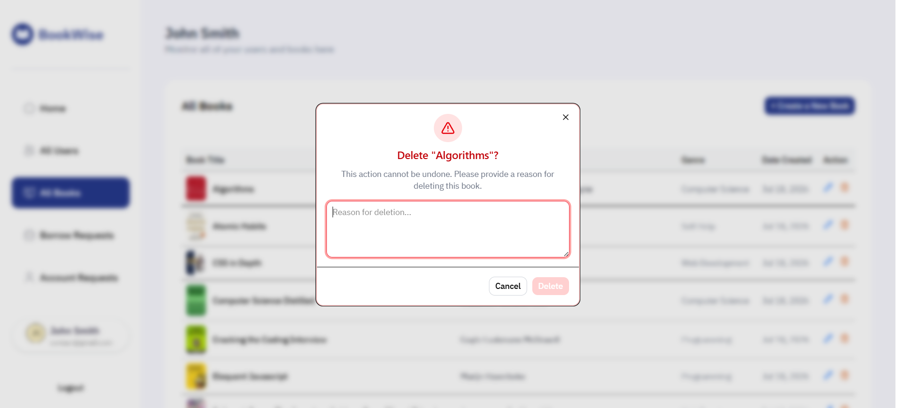

---

### Borrow Requests

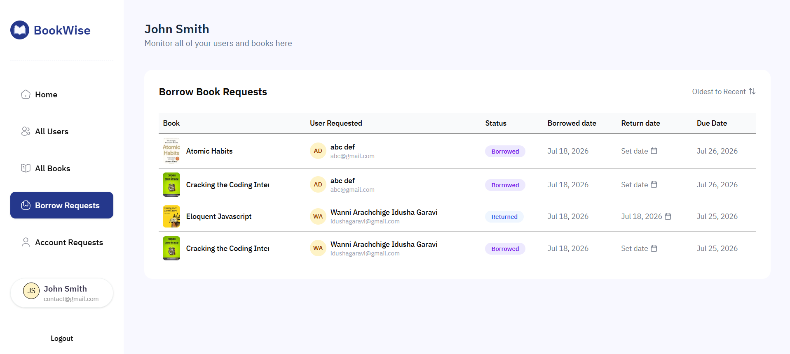

---

### Account Requests

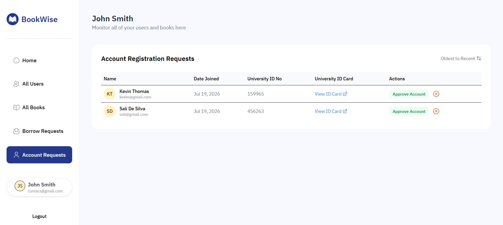

---

### Delete User

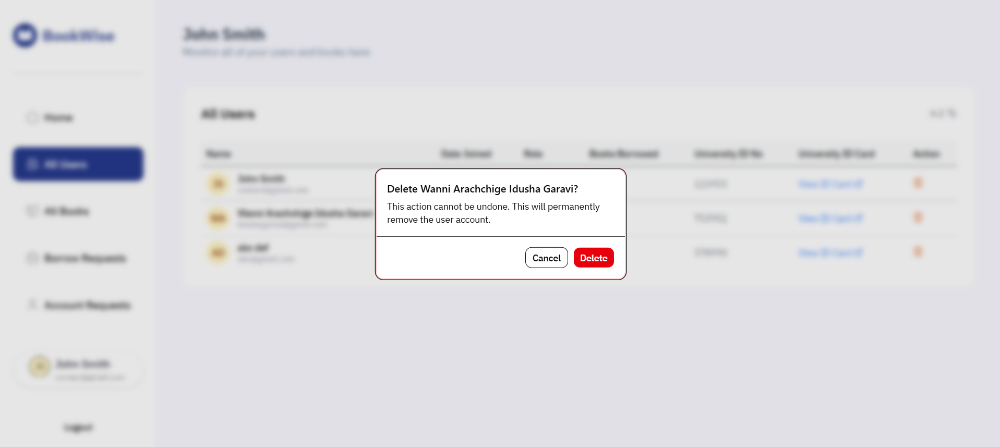

---

## ⚙️ Installation

Clone the repository:

```bash
git clone https://github.com/IdushaGaravi/University-Library-Management.git
```

Navigate to the project directory:

```bash
cd University-Library-Management
```

Install dependencies:

```bash
npm install
```

Run the development server:

```bash
npm run dev
```

Open:

```bash
http://localhost:3000
```

---

## 🔐 Environment Variables

Create a `.env.local` file and add the required environment variables.

Example:

```env
# Appwrite

APPWRITE_ENDPOINT=
APPWRITE_PROJECT_ID=
APPWRITE_DATABASE_ID=
APPWRITE_BUCKET_ID=
APPWRITE_API_KEY=

# PostgreSQL

DATABASE_URL=

# Redis

UPSTASH_REDIS_REST_URL=
UPSTASH_REDIS_REST_TOKEN=

# Resend

RESEND_API_KEY=

# Application

NEXT_PUBLIC_APP_URL=
```

> Ensure that all required credentials are configured before running the application.

---

## 🎯 Key Highlights

- Full Stack Next.js Application
- Production Ready Architecture
- Modern Authentication System
- Admin Dashboard
- PostgreSQL Database Integration
- Email Notification System
- Responsive Design
- Secure API Handling
- Rate Limiting Implementation
- Type-Safe Development using TypeScript
- Deployable on Vercel

---

## 💻 Technologies Used

```text
Frontend
---------
Next.js
React
TypeScript
Tailwind CSS
ShadCN UI

Backend
--------
Next.js Server Actions
Node.js

Database
--------
PostgreSQL
Drizzle ORM
Redis
Upstash Redis

Authentication
--------------
Appwrite

Email Services
--------------
Resend

Deployment
----------
Vercel
```

---

## 🌐 Repository

GitHub Repository:

```text
https://github.com/IdushaGaravi/University-Library-Management
```

---

## 🚀 Live Application

```text
https://university-library-management-8arl809dt-idusha-garavis-projects.vercel.app/sign-in
```

---

## 👨‍💻 Author

### Idusha Garavi

- GitHub: https://github.com/IdushaGaravi

---

## ⭐ Support

If you found this project helpful, consider giving it a star on GitHub.

```bash
⭐ Star this repository if you like it!
```

---

<p align="center">
  Made with ❤️ using Next.js, TypeScript, PostgreSQL, and modern web technologies.
</p>